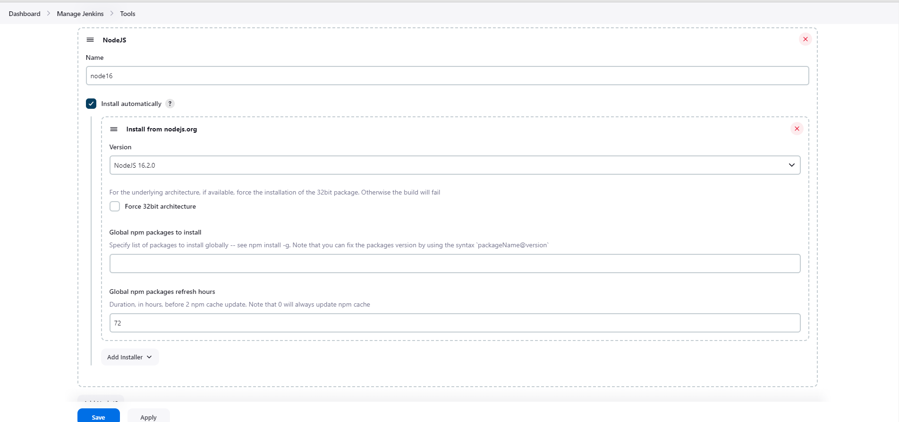

# Installation Jenkins, Sonarqube, Docker, Trivy


```
sudo apt update
sudo apt install fontconfig openjdk-17-jre
java -version

sudo wget -O /usr/share/keyrings/jenkins-keyring.asc \
  https://pkg.jenkins.io/debian/jenkins.io-2023.key
echo deb [signed-by=/usr/share/keyrings/jenkins-keyring.asc] \
  https://pkg.jenkins.io/debian binary/ | sudo tee \
  /etc/apt/sources.list.d/jenkins.list > /dev/null
sudo apt-get update
sudo apt-get install jenkins

# Add Docker's official GPG key:
sudo apt-get update
sudo apt-get install ca-certificates curl
sudo install -m 0755 -d /etc/apt/keyrings
sudo curl -fsSL https://download.docker.com/linux/ubuntu/gpg -o /etc/apt/keyrings/docker.asc
sudo chmod a+r /etc/apt/keyrings/docker.asc

# Docker Installation
# Add the repository to Apt sources:
echo \
  "deb [arch=$(dpkg --print-architecture) signed-by=/etc/apt/keyrings/docker.asc] https://download.docker.com/linux/ubuntu \
  $(. /etc/os-release && echo "$VERSION_CODENAME") stable" | \
  sudo tee /etc/apt/sources.list.d/docker.list > /dev/null
sudo apt-get update

sudo apt-get install docker-ce docker-ce-cli containerd.io docker-buildx-plugin docker-compose-plugin

chmod 777 /var/run/docker.sock

# Start Sonarqube with Docker
docker run -d --name sonar -p 9000:9000 sonarqube:lts-community

# Trivy Installation
wget https://github.com/aquasecurity/trivy/releases/download/v0.49.1/trivy_0.49.1_Linux-64bit.deb
sudo dpkg -i trivy_0.49.1_Linux-64bit.deb
```
# Setup Jenkins
- Add Plugin


- Setup Tools
1. NodeJS 16.2.0

2. sonar 

3. Docker

4. Sonar

add token in jenkins for sonarqube

setup sonarqube server


Generate token with github and docker. After, u can set with username and passwd for credentials on jenkins


# setup notify email

# add credential login google account


# Setup CD 

```
# awscli install
apt install unzip
curl "https://awscli.amazonaws.com/awscli-exe-linux-x86_64.zip" -o "awscliv2.zip"
unzip awscliv2.zip
sudo ./aws/install
# using access key id and access key secret key (u can using iam role for ec2 instance )
aws configure
# eksctl install
# for ARM systems, set ARCH to: `arm64`, `armv6` or `armv7`
ARCH=amd64
PLATFORM=$(uname -s)_$ARCH

curl -sLO "https://github.com/eksctl-io/eksctl/releases/latest/download/eksctl_$PLATFORM.tar.gz"

# (Optional) Verify checksum
curl -sL "https://github.com/eksctl-io/eksctl/releases/latest/download/eksctl_checksums.txt" | grep $PLATFORM | sha256sum --check

tar -xzf eksctl_$PLATFORM.tar.gz -C /tmp && rm eksctl_$PLATFORM.tar.gz

sudo mv /tmp/eksctl /usr/local/bin

curl -LO "https://dl.k8s.io/release/$(curl -L -s https://dl.k8s.io/release/stable.txt)/bin/linux/amd64/kubectl"

curl -LO "https://dl.k8s.io/$(curl -L -s https://dl.k8s.io/release/stable.txt)/bin/linux/amd64/kubectl.sha256"

echo "$(cat kubectl.sha256)  kubectl" | sha256sum --check
sudo install -o root -g root -m 0755 kubectl /usr/local/bin/kubectl

kubectl version --client --output=yaml

eksctl create cluster -n example-cicd --region=us-east-1 -m 1 -M 5 --node-type t2.small --version 1.27
eksctl scale nodegroup --cluster=example-cicd --name=ng-1dac4059 --nodes=3
eksctl get nodegroup --cluster example-cicd --region us-east-1 --name ng-1dac4059
eksctl delete cluster -n example-cicd --region=us-east-1

# Install Helm 3 
curl -fsSL -o get_helm.sh https://raw.githubusercontent.com/helm/helm/main/scripts/get-helm-3
chmod 700 get_helm.sh
bash get_helm.sh

helm repo add prometheus-community https://prometheus-community.github.io/helm-charts

kubectl create ns prometheus

helm install stable prometheus-community/kube-prometheus-stack -n prometheus

kubectl get po -n prometheus

# Change type svc is LoadBalancer and port 8080 -> 9090
kubectl edit svc stable-kube-prometheus-sta-prometheus -n prometheus
# Change type svc is LoadBalancer
kubectl edit svc stable-grafana -n prometheus
# Show passwd grafana with user is admin
kubectl get secret -n prometheus stable-grafana -o jsonpath="{.data.admin-password}" | base64 --decode; echo
```
# Config Grafana and Prometheus

# Import with 15760


# Import with 12740

# Setup ArgoCD
```
curl -sSL -o argocd-linux-amd64 https://github.com/argoproj/argo-cd/releases/latest/download/argocd-linux-amd64

sudo install -m 555 argocd-linux-amd64 /usr/local/bin/argocd

rm argocd-linux-amd64

kubectl create namespace argocd
kubectl apply -n argocd -f https://raw.githubusercontent.com/argoproj/argo-cd/stable/manifests/install.yaml

kubectl patch svc argocd-server -n argocd -p '{"spec": {"type": "LoadBalancer"}}'

kubectl get secret argocd-initial-admin-secret -n argocd -o yaml

argocd login aa632e7233ded4c78bcf1457e20202ac-87716906.us-east-1.elb.amazonaws.com

argocd cluster list

kubectl config get-contexts

root@ip-172-31-56-55:/home/ubuntu# kubectl config get-contexts
CURRENT   NAME                                            CLUSTER                            AUTHINFO                                        NAMESPACE
*         ngochung1809@example-cicd.us-east-1.eksctl.io   example-cicd.us-east-1.eksctl.io   ngochung1809@example-cicd.us-east-1.eksctl.io


argocd cluster add ngochung1809@example-cicd.us-east-1.eksctl.io --name example-cicd
```
# Setup Config Argo
- Connect ArgoCD with User and Token Passwd

# Setup New App


# Setup TOKEN


# Setup Webhook GIthub
http://IP_JENKINS:8080/github-webhook/